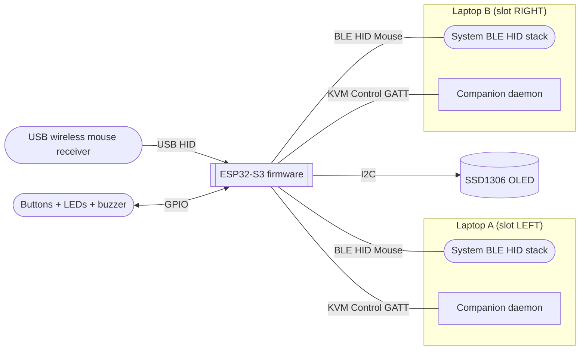
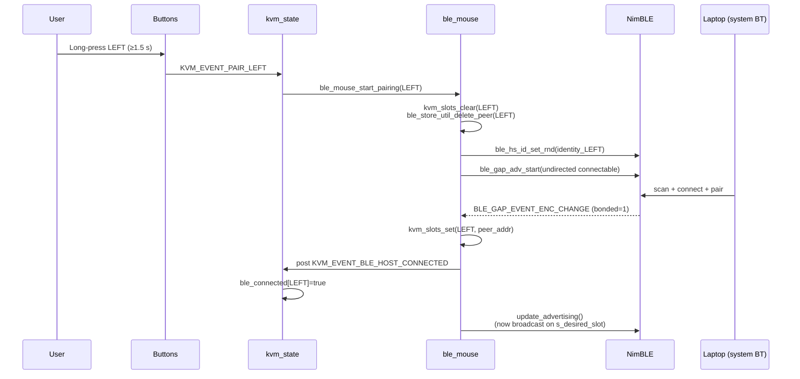
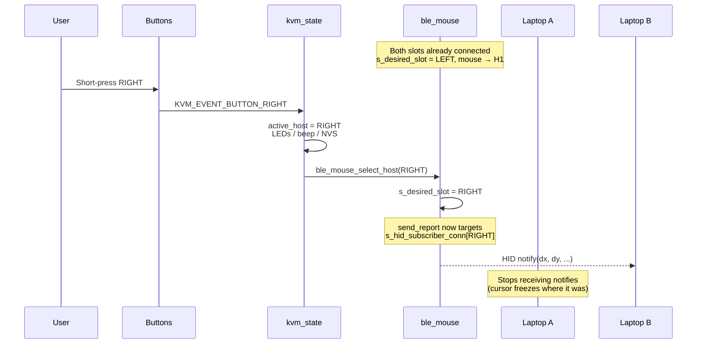
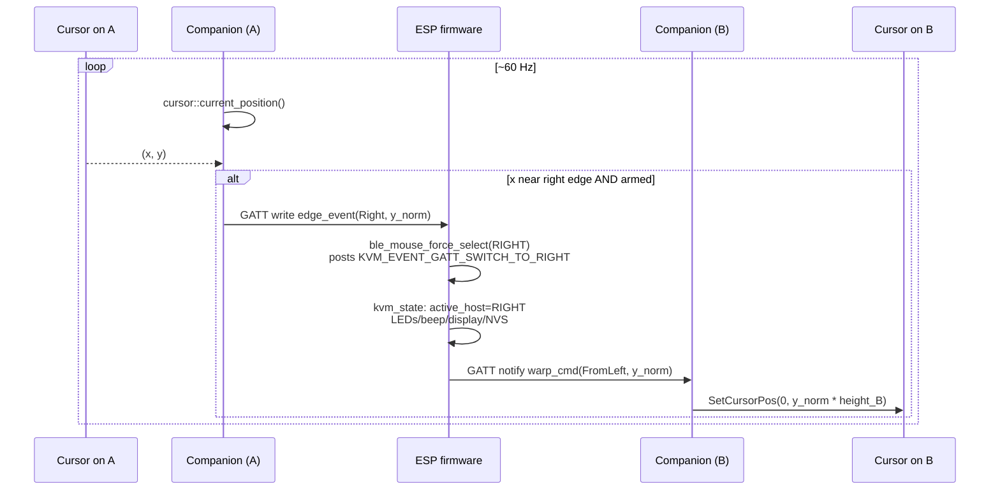
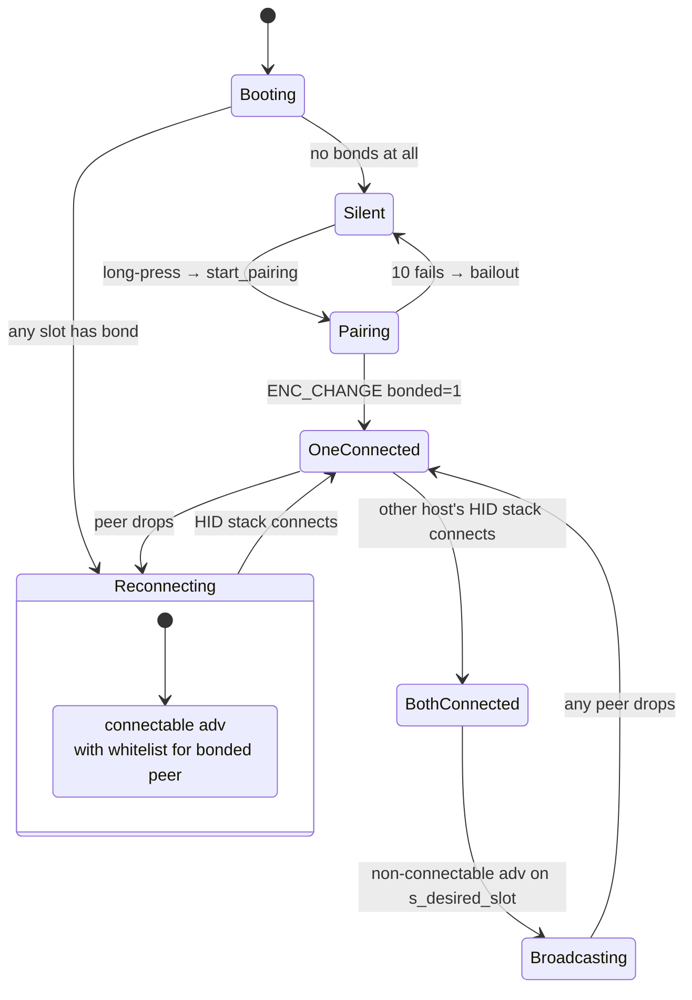

# Architecture

Visual overview of how the firmware, the host laptops, and the companion daemon co-operate. All diagrams here render natively on GitHub via Mermaid.

For the binary wire protocol of the custom GATT service used by the companion, see [`gatt-contract.md`](gatt-contract.md). For non-obvious design decisions and gotchas, see [`../AGENTS.md`](../AGENTS.md).

## System overview



The ESP holds **two simultaneous BLE connections**, one to each host's identity address. Each host's OS subscribes to the standard HID service. The companion daemon on each host attaches to the same BLE link and talks to a custom GATT service used solely for edge events and cursor warp instructions.

## Firmware task layout

```mermaid
flowchart TB
  subgraph FreeRTOS
    btn[button_scan_task<br/>polled, debounced]
    usb[usb_host_task]
    kvm[kvm_task<br/>state machine]
    ui[ui_task<br/>OLED render]
    ble[ble_hid_task<br/>USB→BLE bridge]
    nimble[NimBLE host task]
  end

  q1{{g_kvm_event_queue}}
  q2{{g_mouse_report_queue}}
  state[(kvm_state_t)]
  conn[(s_conn_handle[2]<br/>s_hid_subscriber_conn[2]<br/>s_desired_slot)]

  btn -- KVM_EVENT_BUTTON_* --> q1
  btn -- KVM_EVENT_PAIR_* --> q1
  usb -- USB_MOUSE_* --> q1
  usb -- mouse_report_t --> q2
  q1 --> kvm
  kvm --> state
  kvm --> conn
  state --> ui
  q2 --> ble
  ble -- ble_gatts_notify_custom --> nimble
  conn -.read.- ble

  gattcb[GATT access callbacks<br/>ble_control.c]
  gattcb -- KVM_EVENT_GATT_SWITCH_* --> q1
```

- Buttons and USB Host events fan into a single state queue; the `kvm_task` is the only writer to `kvm_state_t`.
- Mouse reports go through a separate queue so the BLE-side bridge can coalesce and rate-limit them without blocking USB.
- The custom GATT service callbacks (`src/ble_control.c`) post the same `KVM_EVENT_GATT_SWITCH_*` events that the manual button path uses, so an auto-switch updates LEDs / buzzer / display / NVS exactly like a manual switch.

## Pairing flow



After both slots have bonds, subsequent boots auto-reconnect each host under its own identity without any user action.

## Manual switching (button)



No BLE re-negotiation happens during the switch — both links stayed live, the firmware simply changes which `conn_handle` it notifies. Latency is bounded by a single GATT notification.

## Auto switching via companion (edge crossing)



The two companions never talk to each other directly. Everything is mediated by the firmware, which is the only piece that knows the slot mapping (which laptop is on which "side") and the cursor state on both hosts (via the edge_event / warp_cmd characteristics).

## Connection state machine inside `ble_mouse.c`



`update_advertising()` is the single entry point for all advertising state changes — every transition above goes through it. Calling `ble_gap_adv_start` / `ble_gap_adv_stop` from anywhere else in the codebase is a bug.
